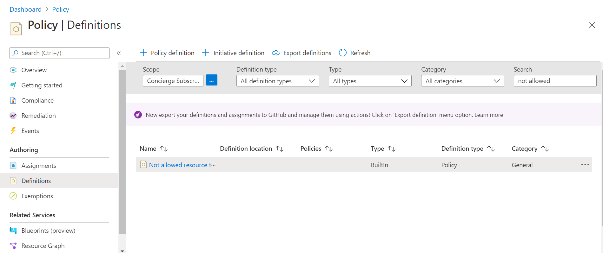
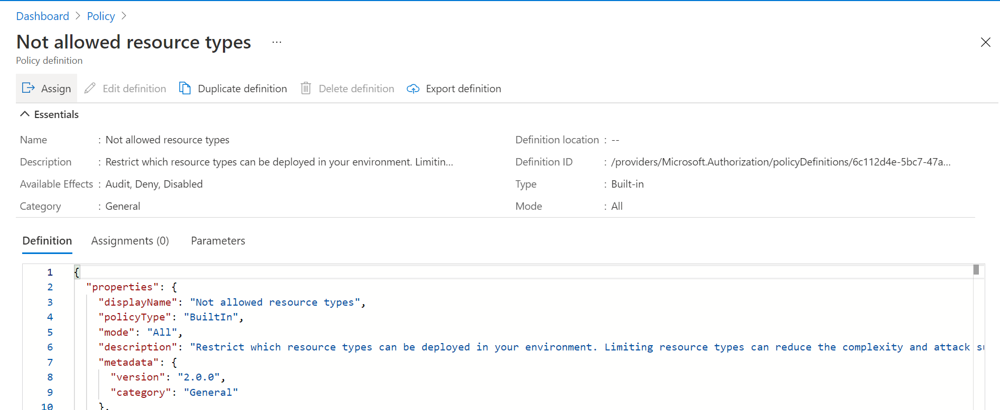
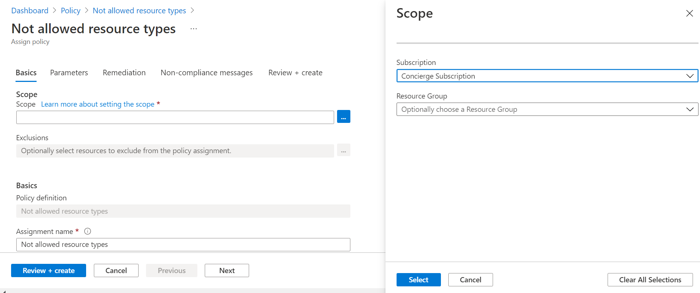
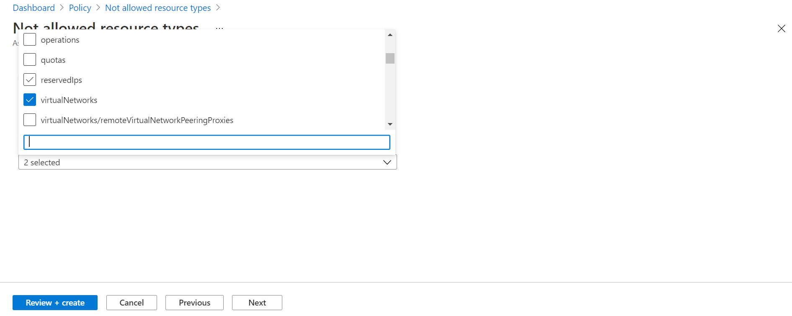
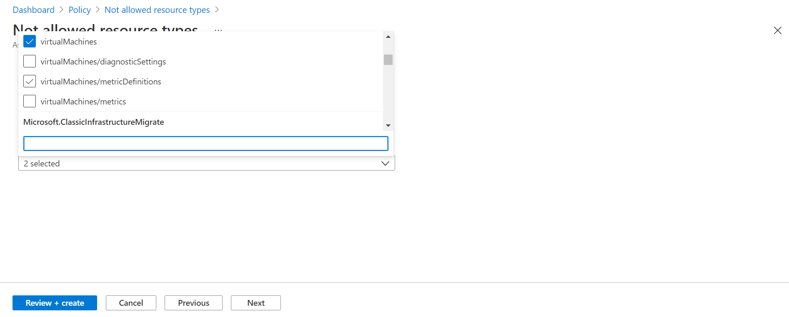

#usecase
<h2>UseCase Scenario</h2>

An on-premises Customer Moved their WorkLoads and assets to Azure and their company has multiple subscriptions which are defined in azure.
now one of the subscriptions assigned to the particular organization which runs on coaching to students with hands-on experience in azure. while doing hands-on, even not require to create vents and VMS, students are creating by assuming they got the solution if I choose to create virtual networks and virtual machines. this leads to additional costs for the particular subscription.

They want to deny the creation of virtual machines and virtual networks so that they can reduce the additional cost incur.

<h2>Solution</h2>

Implementing the policies which are related to virtual networks and virtual machines that are not to allow to creation.
 
<h3>Steps to Implement the Solution</h4>
<ol>
<li>Type "Policy" in the azure search bar. in the sidebar, under AUthoring Section, click on Definitions</li> 
    
  <li>In the search bar, search with not allowed resources, then results came, choose "Not Allowed Resource Types"
</li> 
   
  <li>Then, click on the ASSIGN button to implement the rules that the customer needs.
</li> 
  
  <li>Under the section of BASICS, select the SCOPE which is the subscription for the Customer, under this particular subscription, no one creates the resource which the user wants to deny to create. </li> 
   <li>Under the section of PARAMETERS ,select the resources that user want to deny to create ,here virtual networks and virtual machines,choose these two and create the policy ,it take around five to ten minutes to apply the creted policy to the subscription</li>   

<li>So ,if the someone try to create virual networks or virtual machine in the subscription ,it deny to complete it and its againest policies</li>
</ol>
