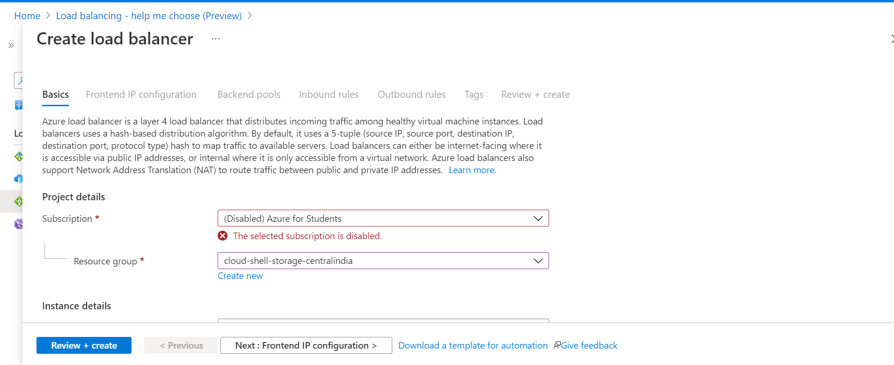
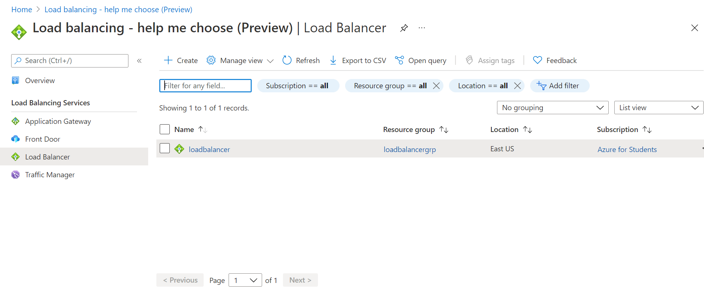
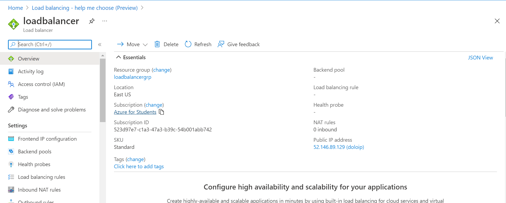
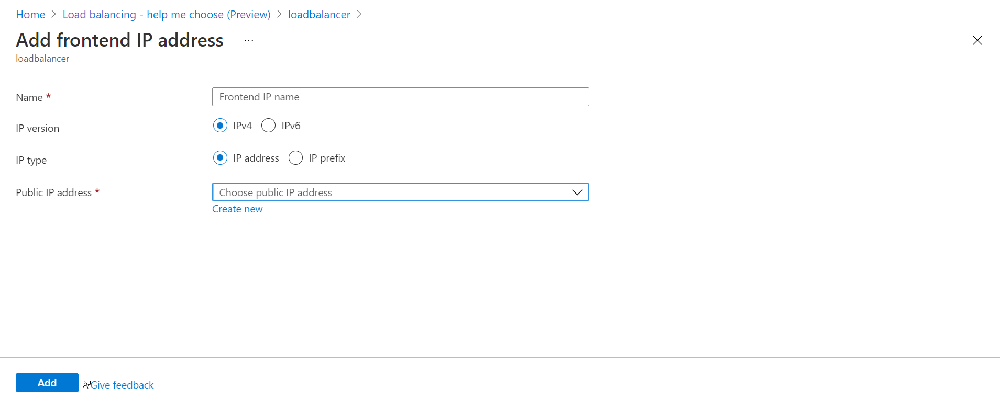
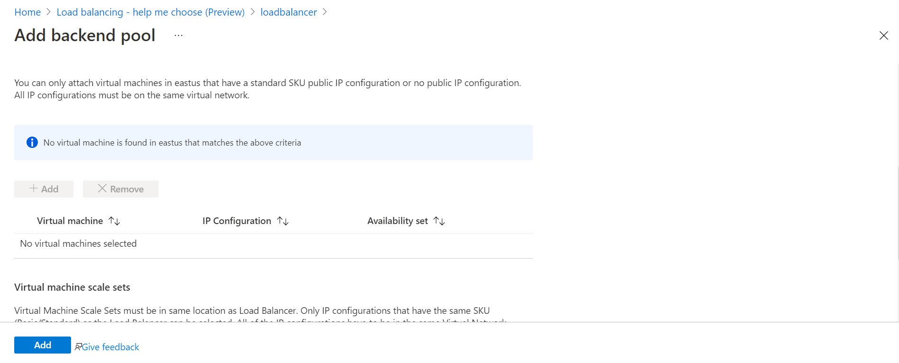
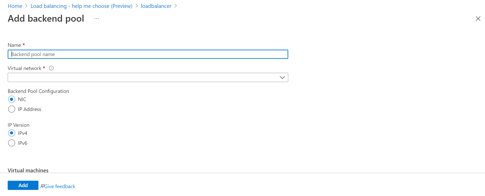
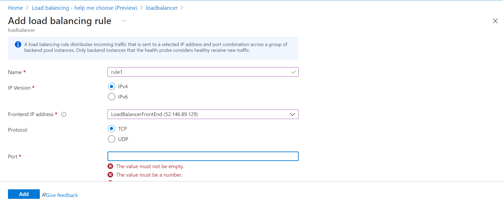

#use case
<h1>Use Case Scenario</h1>

Customer has On-Premise data center and azure virtual network ,in virtual network ,there are two virtual machines hosting the same Application. Company employees established site -site VPN connection.so they actually connect the virtual machines using privite ip address.now they want publish the application 
what are other implementations should be taken for application

<h2>Solution</h2>

Customer want to release the application to public so it may face traffic issues leads to servers down .that is one of virtual machine or both may go down and will not work properly .

In order to avoid this servers down issues,if we design to share/balance the traffic to each virtual machine ,there is high possibility that servers will run in good health

Even the servers increases to manage traffic ,for all servers need a guide that how to distribute the traffic among them.

So Load balancing serices are the solution and for this usecase load balancer is enough 

**NOTE** if no.of virtual machines hosted an application more than one ,make sure that they are in part of availability set or virtual machine scale set in case of basic Load Balancer

<h3>Basic Pre requisites that need to build this Structure in azure </h3>
<ol>
<li>Virtual machines to host an application and are need to be part of availability set or virtual machine scale set.</li>
<li>Azure Load Balncer ,backend pool,health probe,load balancing rules,public ip address </li>
<li>Public ip address is assigned to azure load balancer not for virtual machines </li>
</ol>
<h3>Internal Process after implentation and how application works</h3>
<ol>
<li>Create public IP address,azure load balancer and then need to create backend pool and need to add health probe</li>
<li>Backend pool contains virtual machines .we need to configure the virtual machines corresponding to the application in backend pool. </li> 
<li>Adding the health probe will help the load balancer understand if virtual machines are health(like heart beat)  </li> 
<li>Load balancing rules helps when the request comes from the user to the load balncer,the request will be routed across the virtual machines (balancing the traffic),so when multiple requests comes ,then these requests will split across the Virtual machines which are part of backend pool.</li></ol>
 
<h2>Steps to Implement the Solution In azure</h2>
<ol>
<li>Navigate to load balancer option in azure portal by searching in search bar or its availble in market place. </li>
<li>Enter the relevent details based on the requirement and create the load balancer.</li>  
   
<li>Click on load balancer,in left side ,under SETTINGS ,there are four options likely 1.Frontend IP configuration 2.Backend Pools 3.Health Probes 4.Load Balancing Rules, </li>   
<li>Click on frontend ip config, and add public Ip address. </li> 
<li>Under Backend Pool,add the two virtual machines which are hosted for an application</li>    
<li>Under Health Probe ,configure the details as well</li>  
<li>Add balancing rules ,so that requests will split accross the virtual machines</li>  
</ol>
